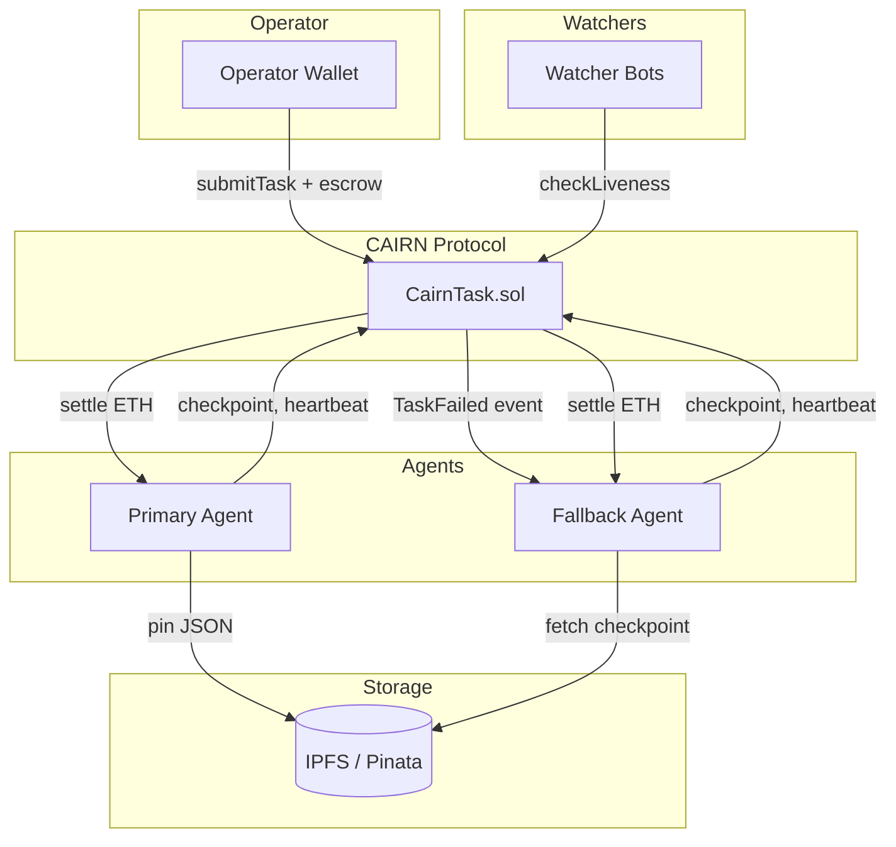
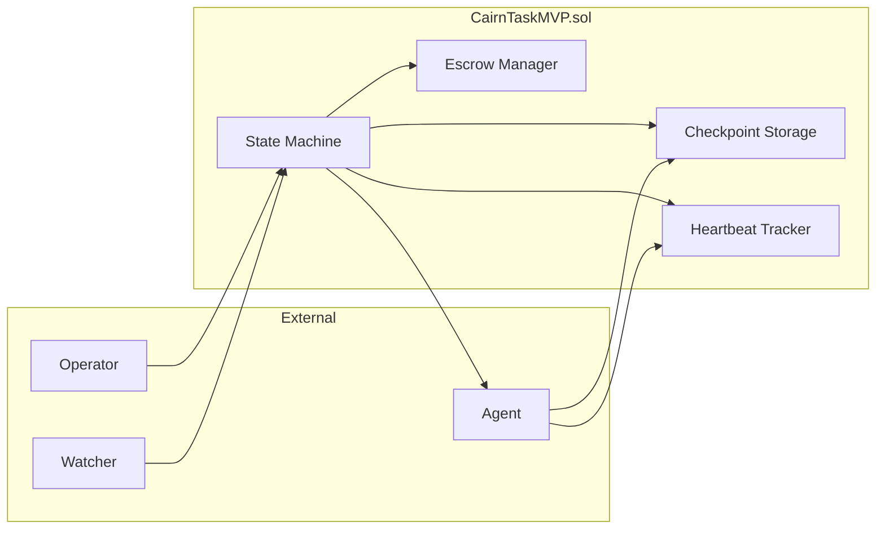
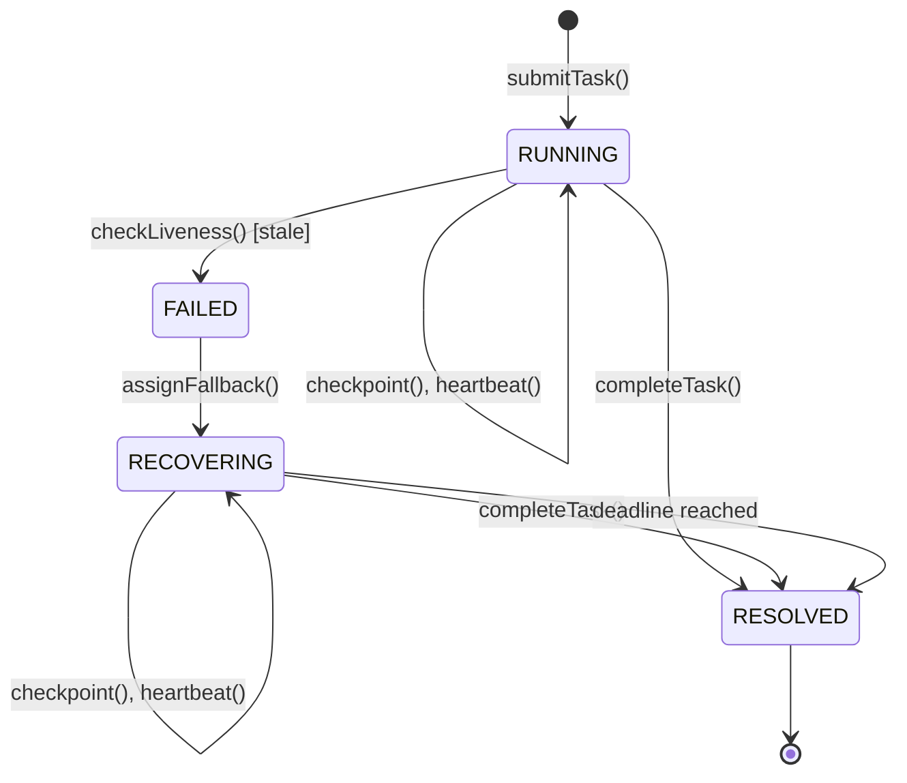

# PRD-01: CAIRN MVP — Synthesis Hackathon

> Minimum Viable Protocol for March 13-23, 2026

| Field | Value |
|-------|-------|
| **PRD ID** | PRD-01 |
| **Title** | CAIRN Hackathon MVP |
| **Status** | Draft |
| **Priority** | P0 |
| **Author** | CAIRN Team |
| **Created** | March 2026 |
| **Timeline** | ~10 days (March 13-23) |
| **Feedback Checkpoint** | March 18 |
| **Complexity** | L (multi-component, new contracts) |
| **Repos Affected** | `cairn-protocol` (new), frontend (new) |

---

## 0. Breaking Changes

This is a **greenfield project** — no existing systems to break. However, integrators should note:

- **New ERC-8183 hook pattern** — CAIRN implements `IJobHook` interface; operators must grant hook permissions
- **IPFS dependency** — Agents must have IPFS write access (Pinata account required)
- **Base Sepolia deployment** — Not compatible with mainnet until audit complete
- **Hardcoded fallback** — MVP uses pre-configured fallback address, not open pool

### MVP vs Production Agents

| Aspect | MVP (Hackathon) | Production (PRD-04+) |
|--------|-----------------|----------------------|
| **Agent Control** | Demo controller script orchestrates timing | Fully autonomous agents |
| **Failure Injection** | Manual (kill switch, stop heartbeat) | Natural failures (rate limits, crashes) |
| **Fallback Selection** | Hardcoded address | Fallback pool with reputation ranking |
| **On-Chain Interactions** | **REAL** (testnet) | **REAL** (mainnet) |
| **IPFS Checkpoints** | **REAL** | **REAL** |
| **Contract State** | **REAL** | **REAL** |

The protocol is **production-agent-ready from day one**. MVP uses controlled agents only for demo reliability—not because the protocol requires it. See `/docs/real-agent-integration.md` for production agent requirements.

---

## 1. Purpose & Problem

### 1.1 Problem Statement

**Agent workflows fail 80% of the time.** At 85% per-action success rate, a 10-step task completes only ~20% of the time (0.85^10 = 0.197).

When an agent fails mid-task today:
- **Work is lost** — No checkpoint, so fallback must restart from zero
- **Money is locked** — Escrow sits in limbo until manual intervention
- **Time bleeds** — Operators discover failures hours later
- **Ecosystem doesn't learn** — Same failures repeat across agents

**Real Example (The 2:47am Failure):**
| Metric | Without CAIRN | With CAIRN |
|--------|---------------|------------|
| Detection time | 4.5 hours (manual) | 45 seconds (heartbeat) |
| Recovery method | Full restart | Resume from checkpoint 3 |
| Gas wasted | $12 (repeat steps 1-2) | $0 |
| Escrow delay | 4.5 hours locked | 21 minutes to settlement |
| Original agent payment | $0 (task failed) | $24 (60% for 3/5 steps) |

### 1.2 Why Now?

1. **Synthesis Hackathon deadline** — March 23, 2026 (10 days)
2. **ERC-8183 just deployed** — Job escrow standard now live on Base
3. **Olas ecosystem ready** — 600+ agents as potential fallback pool
4. **First-mover advantage** — No standard failure protocol exists

### 1.3 Who Is Affected

| Persona | Pain | How MVP Helps |
|---------|------|---------------|
| **Operator** | Submits task, agent dies, escrow locked for hours | Automatic recovery, fair settlement |
| **Primary Agent** | Does 60% of work, gets 0% payment on failure | Gets paid for verified checkpoints |
| **Fallback Agent** | No standardized way to pick up failed tasks | Receives checkpoint state, earns proportional pay |
| **Ecosystem** | Same failures repeat, no shared learning | (MVP: deferred to PRD-03) |

### 1.4 Success Metrics

| Metric | Current | Target | Method |
|--------|---------|--------|--------|
| Demo completion | N/A | 100% | End-to-end demo works without manual intervention |
| Recovery time | N/A | < 2 minutes | Time from failure detection to fallback resuming |
| Checkpoint integrity | N/A | 100% | All checkpoints readable by fallback |
| Judge comprehension | N/A | > 80% | Post-demo survey: "I understand the value prop" |
| Code quality | N/A | No hacks | Clean architecture for post-hackathon iteration |

---

## 2. Features & Functionality

### 2.1 Sub-Feature: Task Submission (SF-01)

**Purpose**: Operator submits a task specification with escrow, assigning primary and fallback agents.

**Data Sources**:
- Operator wallet (escrow deposit)
- Task specification (off-chain JSON, hash stored on-chain)

**Collection/Processing Steps**:
1. Operator constructs `TaskSpec` JSON with subtask definitions
2. Operator calls `submitTask()` with spec hash, agent addresses, escrow
3. Contract validates escrow amount ≥ minimum (0.001 ETH)
4. Contract stores task in `RUNNING` state
5. Contract emits `TaskSubmitted` event

**Output Schema**:
```json
{
  "taskId": "bytes32 — keccak256 hash of (operator, nonce, block.timestamp)",
  "operator": "address",
  "primaryAgent": "address",
  "fallbackAgent": "address",
  "escrow": "uint256 — wei",
  "heartbeatInterval": "uint256 — seconds",
  "deadline": "uint256 — block.timestamp",
  "state": "enum — RUNNING",
  "specHash": "bytes32 — keccak256 of TaskSpec JSON"
}
```

**Failure Mode**:
- Insufficient escrow → Revert with `InsufficientEscrow(required, provided)`
- Zero addresses → Revert with `InvalidAddress()`
- Deadline in past → Revert with `InvalidDeadline()`

**Downstream Consumers**: Checkpoint system (SF-02), Heartbeat system (SF-03)

---

### 2.2 Sub-Feature: Checkpoint Protocol (SF-02)

**Purpose**: Agent saves subtask outputs to IPFS and commits CID on-chain, enabling resume-not-restart recovery.

**Data Sources**:
- Agent execution output (JSON)
- Pinata IPFS API (`https://api.pinata.cloud/pinning/pinJSONToIPFS`)
- CairnTask contract (checkpoint storage)

**Collection/Processing Steps**:
1. Agent completes subtask N, produces output JSON
2. Agent calls Pinata API to pin JSON:
   ```python
   response = requests.post(
       "https://api.pinata.cloud/pinning/pinJSONToIPFS",
       headers={"Authorization": f"Bearer {PINATA_JWT}"},
       json={"pinataContent": output_data}
   )
   cid = response.json()["IpfsHash"]
   ```
3. Agent calls `commitCheckpoint(taskId, cid)` on contract
4. Contract validates:
   - Task is in RUNNING or RECOVERING state
   - Caller is assigned agent (primary or fallback)
   - Checkpoint index is sequential (no gaps)
5. Contract stores CID, increments checkpoint count
6. Contract emits `CheckpointCommitted(taskId, index, cid)`

**Output Schema**:
```json
{
  "checkpoints": [
    {
      "index": 0,
      "cid": "QmXyz... — 46-char IPFS CID",
      "committedBy": "address — primary or fallback",
      "timestamp": "uint256",
      "blockNumber": "uint256"
    }
  ],
  "primaryCheckpoints": "uint256 — count by primary",
  "fallbackCheckpoints": "uint256 — count by fallback"
}
```

**Failure Mode**:
- Pinata API fails → Agent retries 3x with exponential backoff, then reports `RESOURCE` failure
- Invalid CID format → Revert with `InvalidCID()`
- Non-sequential index → Revert with `CheckpointGap(expected, provided)`
- Unauthorized caller → Revert with `Unauthorized()`

**Downstream Consumers**: Recovery system (SF-05), Settlement system (SF-06)

---

### 2.3 Sub-Feature: Heartbeat System (SF-03)

**Purpose**: Agent emits periodic liveness signals; missed heartbeat triggers failure detection.

**Data Sources**:
- Agent process (heartbeat sender)
- CairnTask contract (heartbeat storage)
- Public watchers (liveness enforcers)

**Collection/Processing Steps**:
1. Agent starts background thread on task confirmation
2. Every `heartbeatInterval` seconds, agent calls `heartbeat(taskId)`
3. Contract validates caller is assigned agent, updates `lastHeartbeat`
4. Contract emits `HeartbeatReceived(taskId, block.timestamp)`
5. **Anyone** can call `checkLiveness(taskId)` at any time
6. If `block.timestamp > lastHeartbeat + heartbeatInterval`:
   - Contract transitions task to `FAILED`
   - Contract emits `TaskFailed(taskId, "HEARTBEAT_MISS")`

**Output Schema**:
```json
{
  "lastHeartbeat": "uint256 — block.timestamp of last heartbeat",
  "heartbeatInterval": "uint256 — required interval in seconds",
  "isStale": "bool — true if heartbeat overdue"
}
```

**Failure Mode**:
- Agent process crash → No heartbeat, `checkLiveness()` triggers FAILED
- Network partition → Same as crash from contract's perspective
- Gas spike prevents heartbeat → Agent should use high priority fee

**Downstream Consumers**: Failure detection triggers Recovery system (SF-05)

---

### 2.4 Sub-Feature: Liveness Enforcement (SF-04)

**Purpose**: Permissionless enforcement — anyone can trigger failure detection, no trusted keeper required.

**Data Sources**:
- CairnTask contract (task state, heartbeat data)
- External watchers (bots, operators, competitors)

**Collection/Processing Steps**:
1. Watcher monitors `TaskSubmitted` events, tracks active tasks
2. Watcher checks `isStale(taskId)` periodically (every 30 seconds recommended)
3. If stale, watcher calls `checkLiveness(taskId)`
4. Contract validates staleness, transitions to FAILED
5. Watcher receives small gas refund (optional, configurable)

**Output Schema**:
```solidity
function checkLiveness(bytes32 taskId) external {
    // Emits: TaskFailed(taskId, "HEARTBEAT_MISS")
    // Returns: void (reverts if not stale)
}
```

**Failure Mode**:
- No watchers active → Task may run past deadline; deadline enforcement is separate
- False positive (race condition) → Not possible; staleness is deterministic
- Watcher spam → No harm; redundant calls just revert with `NotStale()`

**Downstream Consumers**: Triggers Recovery system (SF-05)

---

### 2.5 Sub-Feature: Recovery Assignment (SF-05)

**Purpose**: When primary fails, assign fallback agent and transfer checkpoint state.

**Data Sources**:
- CairnTask contract (task state, checkpoints)
- IPFS (checkpoint data for fallback to read)

**Collection/Processing Steps**:
1. Task transitions to `FAILED` (via SF-04 or explicit failure report)
2. Contract reads pre-configured `fallbackAgent` address
3. Contract transitions task to `RECOVERING`
4. Contract emits `FallbackAssigned(taskId, fallbackAgent, checkpointCIDs[])`
5. Fallback agent receives event, reads checkpoint CIDs
6. Fallback fetches last checkpoint from IPFS:
   ```python
   last_cid = checkpoint_cids[-1]
   response = requests.get(f"https://gateway.pinata.cloud/ipfs/{last_cid}")
   last_output = response.json()
   ```
7. Fallback resumes from next subtask using `last_output` as input
8. Fallback continues checkpointing (SF-02) and heartbeating (SF-03)

**Output Schema**:
```json
{
  "taskId": "bytes32",
  "state": "RECOVERING",
  "fallbackAgent": "address",
  "checkpointCIDs": ["Qm...", "Qm...", "Qm..."],
  "nextSubtaskIndex": 3,
  "remainingBudget": "uint256 — escrow minus gas spent",
  "remainingDeadline": "uint256 — blocks until deadline"
}
```

**Failure Mode**:
- Fallback agent offline → Task remains in RECOVERING until deadline, then auto-refund
- IPFS gateway down → Fallback retries with alternate gateway (ipfs.io, dweb.link)
- Checkpoint data corrupted → Fallback reports failure, task moves to DISPUTED (MVP: auto-refund)

**Downstream Consumers**: Settlement system (SF-06)

---

### 2.6 Sub-Feature: Escrow Settlement (SF-06)

**Purpose**: Split escrow proportionally based on verified checkpoint contributions.

**Data Sources**:
- CairnTask contract (checkpoint counts)
- Agent addresses (payment recipients)

**Collection/Processing Steps**:
1. Task reaches terminal state (success or deadline)
2. Anyone calls `settle(taskId)`
3. Contract calculates shares:
   ```solidity
   uint256 total = primaryCheckpoints + fallbackCheckpoints;
   uint256 protocolFee = escrow * PROTOCOL_FEE_BPS / 10000; // 0.5% = 50 bps
   uint256 distributable = escrow - protocolFee;
   uint256 primaryShare = distributable * primaryCheckpoints / total;
   uint256 fallbackShare = distributable * fallbackCheckpoints / total;
   ```
4. Contract transfers ETH to agents
5. Contract emits `TaskResolved(taskId, primaryShare, fallbackShare, protocolFee)`
6. Contract transitions task to `RESOLVED`

**Output Schema**:
```json
{
  "taskId": "bytes32",
  "state": "RESOLVED",
  "settlement": {
    "primaryAgent": "address",
    "primaryShare": "uint256 — wei",
    "primaryCheckpoints": 3,
    "fallbackAgent": "address",
    "fallbackShare": "uint256 — wei",
    "fallbackCheckpoints": 2,
    "protocolFee": "uint256 — wei",
    "totalCheckpoints": 5
  }
}
```

**Failure Mode**:
- Zero checkpoints → Full refund to operator (no work done)
- Settlement already done → Revert with `AlreadySettled()`
- Reentrancy → Use `ReentrancyGuard`, CEI pattern

**Downstream Consumers**: None (terminal)

---

### 2.7 User Workflows

**Workflow: Happy Path (No Failure)**
1. Operator submits task with 0.1 ETH escrow
2. Primary agent executes, checkpoints after each subtask (5 total)
3. Primary emits heartbeat every 60 seconds
4. Primary completes all subtasks, calls `completeTask()`
5. Settlement: Primary receives 0.0995 ETH (99.5%), Protocol receives 0.0005 ETH (0.5%)
6. **Outcome**: Task RESOLVED, primary paid in full

**Workflow: Recovery Path (Primary Fails)**
1. Operator submits task with 0.1 ETH escrow
2. Primary completes 3 subtasks, checkpoints each
3. Primary crashes (no heartbeat for 90 seconds)
4. Watcher calls `checkLiveness()` → Task moves to FAILED
5. Fallback assigned, reads checkpoint 3 from IPFS
6. Fallback completes subtasks 4-5, checkpoints each
7. Settlement: Primary 0.0597 ETH (60%), Fallback 0.0398 ETH (40%), Protocol 0.0005 ETH
8. **Outcome**: Task RESOLVED, both agents paid fairly

**Workflow: Total Failure (No Recovery)**
1. Operator submits task
2. Primary fails immediately (0 checkpoints)
3. Fallback assigned but also fails (0 checkpoints)
4. Deadline reached
5. Settlement: Full refund to operator
6. **Outcome**: Task RESOLVED, operator made whole

---

### 2.8 Edge Cases

| # | Edge Case | Expected Behavior |
|---|-----------|-------------------|
| EC-1 | Primary completes all subtasks, never calls `completeTask()` | Deadline triggers settlement; primary gets 100% |
| EC-2 | Heartbeat sent 1 second before check | Valid; task continues |
| EC-3 | Two watchers call `checkLiveness()` simultaneously | First succeeds, second reverts with `NotStale()` |
| EC-4 | Fallback tries to checkpoint before assignment | Revert with `Unauthorized()` |
| EC-5 | IPFS returns 404 for checkpoint CID | Fallback retries alt gateway; if all fail, reports failure |
| EC-6 | Gas price spikes during heartbeat | Agent should use priority fee; if missed, that's agent risk |
| EC-7 | Operator sets heartbeat interval to 0 | Contract enforces minimum (30 seconds) |
| EC-8 | Task escrow is exactly minimum | Allowed; proceeds normally |

### 2.9 Out of Scope (MVP)

- **NOT: Recovery scoring** — All failures route to RECOVERING (PRD-02)
- **NOT: Failure classification** — No LIVENESS/RESOURCE/LOGIC distinction (PRD-02)
- **NOT: DISPUTED state** — No arbiter system (PRD-05)
- **NOT: Fallback pool** — Hardcoded fallback address (PRD-04)
- **NOT: Execution intelligence** — No pre-task queries (PRD-03)
- **NOT: ERC-7710 delegation** — Direct assignment only (PRD-04)
- **NOT: Governance** — Admin-controlled parameters (PRD-06)

---

## 3. Architecture

### 3.1 System Overview



### 3.2 Component Breakdown

| Component | Repo | Responsibility | New / Modified |
|-----------|------|----------------|----------------|
| CairnTaskMVP.sol | `cairn-protocol/contracts` | State machine, escrow, checkpoints | New |
| CheckpointStore | `cairn-protocol/sdk` | IPFS read/write wrapper | New |
| CairnAgent | `cairn-protocol/sdk` | Agent wrapper (checkpoint + heartbeat) | New |
| Demo Frontend | `cairn-protocol/frontend` | Task visualization, demo controls | New |
| Watcher Bot | `cairn-protocol/watcher` | Liveness enforcement | New |

### 3.3 Contract Architecture



### 3.4 Technical Decisions

| Decision | Options Considered | Choice | Reasoning |
|----------|-------------------|--------|-----------|
| Checkpoint storage | On-chain bytes, IPFS CID, Arweave | **IPFS CID** | Gas efficient (32 bytes), Pinata free tier, widespread support |
| Heartbeat mechanism | Block-based, timestamp-based, oracle | **Timestamp** | Simpler, Base has consistent 2s blocks |
| Fallback selection | Open pool, operator choice, hardcoded | **Hardcoded** | MVP simplicity; pool in PRD-04 |
| Settlement trigger | Auto on completion, manual call | **Manual call** | Explicit, gas paid by caller |
| State storage | Mapping, array, external registry | **Mapping** | O(1) lookup, simple |

### 3.5 State Machine

> **Note:** The full CAIRN Protocol (PRD-00) defines 6 states: IDLE, RUNNING, FAILED, RECOVERING, DISPUTED, RESOLVED. For the MVP, we simplify to **4 states** (RUNNING, FAILED, RECOVERING, RESOLVED), deferring IDLE pre-task queries and DISPUTED arbiter resolution to PRD-02 and PRD-05 respectively. This is a deliberate MVP scope reduction—the contract is structured to support the full state machine post-hackathon.



---

## 4. Dependencies

### 4.1 Internal Dependencies

| Dependency | Repo | Status | Blocking? |
|------------|------|--------|-----------|
| None | — | — | — |

### 4.2 External Dependencies

| Package / Service | Version | Purpose | Risk |
|-------------------|---------|---------|------|
| OpenZeppelin Contracts | 5.0.0 | ReentrancyGuard, Ownable | Low |
| Foundry | Latest | Contract development, testing | Low |
| Pinata SDK | 0.2.0 | IPFS pinning | Low (free tier) |
| wagmi | 2.x | Frontend wallet integration | Low |
| viem | 2.x | Contract interactions | Low |
| Next.js | 14.x | Demo frontend | Low |

### 4.3 External APIs

| API | Endpoint | Rate Limit | Fallback |
|-----|----------|------------|----------|
| Pinata | `api.pinata.cloud` | 200 req/min (free) | Retry with backoff |
| IPFS Gateway | `gateway.pinata.cloud` | 500 req/min | `ipfs.io`, `dweb.link` |
| Base Sepolia RPC | Alchemy/Infura | 300 req/sec | Multiple providers |

### 4.4 Execution Order

1. **Day 1-2**: CairnTaskMVP.sol (core contract)
2. **Day 3**: Deploy to Base Sepolia, verify
3. **Day 4**: CheckpointStore SDK
4. **Day 5**: CairnAgent wrapper
5. **Day 6-7**: Demo frontend
6. **Day 8**: Watcher bot
7. **Day 9-10**: Integration testing, polish

---

## 5. API Contracts

### 5.1 Solidity Interface

```solidity
// SPDX-License-Identifier: MIT
pragma solidity ^0.8.20;

interface ICairnTaskMVP {
    // Enums
    enum State { RUNNING, FAILED, RECOVERING, RESOLVED }

    // Events
    event TaskSubmitted(
        bytes32 indexed taskId,
        address indexed operator,
        address primaryAgent,
        address fallbackAgent,
        uint256 escrow
    );
    event CheckpointCommitted(
        bytes32 indexed taskId,
        uint256 index,
        bytes32 cid,
        address agent
    );
    event HeartbeatReceived(
        bytes32 indexed taskId,
        uint256 timestamp
    );
    event TaskFailed(
        bytes32 indexed taskId,
        string reason
    );
    event FallbackAssigned(
        bytes32 indexed taskId,
        address fallbackAgent
    );
    event TaskResolved(
        bytes32 indexed taskId,
        uint256 primaryShare,
        uint256 fallbackShare,
        uint256 protocolFee
    );

    // Core functions
    function submitTask(
        address primaryAgent,
        address fallbackAgent,
        bytes32 specHash,
        uint256 heartbeatInterval,
        uint256 deadline
    ) external payable returns (bytes32 taskId);

    function commitCheckpoint(
        bytes32 taskId,
        bytes32 cid
    ) external;

    function heartbeat(bytes32 taskId) external;

    function checkLiveness(bytes32 taskId) external;

    function completeTask(bytes32 taskId) external;

    function settle(bytes32 taskId) external;

    // View functions
    function getTask(bytes32 taskId) external view returns (
        State state,
        address operator,
        address primaryAgent,
        address fallbackAgent,
        uint256 escrow,
        uint256 primaryCheckpoints,
        uint256 fallbackCheckpoints,
        uint256 lastHeartbeat,
        uint256 deadline
    );

    function getCheckpoints(bytes32 taskId) external view returns (bytes32[] memory cids);

    function isStale(bytes32 taskId) external view returns (bool);
}
```

### 5.2 Python SDK Interface

```python
from typing import List, Optional
from dataclasses import dataclass

@dataclass
class Task:
    task_id: str
    state: str  # RUNNING, FAILED, RECOVERING, RESOLVED
    operator: str
    primary_agent: str
    fallback_agent: str
    escrow: int  # wei
    primary_checkpoints: int
    fallback_checkpoints: int
    last_heartbeat: int  # timestamp
    deadline: int  # timestamp
    checkpoint_cids: List[str]

class CairnClient:
    def __init__(self, rpc_url: str, contract_address: str, private_key: str):
        """Initialize CAIRN client."""

    async def submit_task(
        self,
        primary_agent: str,
        fallback_agent: str,
        spec: dict,
        heartbeat_interval: int,
        deadline: int,
        escrow: int
    ) -> str:
        """Submit task, return task_id."""

    async def get_task(self, task_id: str) -> Task:
        """Get task details."""

class CairnAgent:
    def __init__(
        self,
        agent: Any,  # Your agent instance
        client: CairnClient,
        ipfs: CheckpointStore
    ):
        """Wrap agent with CAIRN protocol."""

    async def execute(self, task_id: str, subtasks: List[dict]) -> dict:
        """Execute task with automatic checkpointing and heartbeat."""

    async def resume(self, task_id: str, from_checkpoint: int) -> dict:
        """Resume task from checkpoint (for fallback)."""

class CheckpointStore:
    def __init__(self, pinata_jwt: str):
        """Initialize IPFS checkpoint store."""

    async def write(self, data: dict) -> str:
        """Write checkpoint, return CID."""

    async def read(self, cid: str) -> dict:
        """Read checkpoint data."""
```

---

## 6. Open Questions & Spikes

| # | Question | Current Assumption | Spike to Validate | Blocks |
|---|----------|-------------------|-------------------|--------|
| Q1 | What if Pinata is down during demo? | Use backup gateway | Test failover to ipfs.io | Demo reliability |
| Q2 | How to inject failure for demo? | Separate "kill switch" button | Build demo control panel | Demo script |
| Q3 | What's minimum viable heartbeat interval? | 60 seconds | Test with 30s on Base Sepolia | Gas costs |
| Q4 | How to handle gas price spikes? | Agent uses priority fee | Monitor Base gas patterns | Agent reliability |
| Q5 | Should settlement be automatic? | Manual call to save gas | Test auto-settle on deadline | UX decision |

### Spike Results (Update as resolved)
- **Q1**: TBD
- **Q2**: TBD
- **Q3**: TBD
- **Q4**: TBD
- **Q5**: TBD

---

## 7. Failure Modes & Rollback

### 7.1 Known Risks

| Risk | Likelihood | Impact | Mitigation |
|------|------------|--------|------------|
| Contract bug loses funds | Low | Critical | Thorough testing, use established patterns |
| IPFS gateway down | Low | High | Multiple gateway fallbacks |
| Demo crashes during presentation | Medium | High | Pre-record backup video |
| Gas spike prevents heartbeat | Low | Medium | Use priority fee, generous interval |
| Fallback agent offline | Medium | Medium | Deadline auto-refund as safety net |

### 7.2 Error Handling

| Error | User Message | Recovery |
|-------|--------------|----------|
| Transaction reverted | "Transaction failed: [reason]" | Show retry button with error details |
| IPFS upload failed | "Checkpoint upload failed" | Retry 3x, then show manual retry |
| Heartbeat missed | "Agent stopped responding" | Show recovery progress |
| Settlement failed | "Settlement pending" | Retry button, show task state |

### 7.3 Rollback Plan

| Component | Rollback Method |
|-----------|-----------------|
| Contract | Deploy fixed version, migrate tasks manually if needed |
| Frontend | Revert to previous commit, redeploy |
| SDK | Pin to previous version in requirements |

**Note**: MVP on testnet — low rollback stakes. Production rollback plan in PRD-06.

---

## 8. Test Cases

### 8.1 Acceptance Criteria

| # | Given | When | Then | Priority |
|---|-------|------|------|----------|
| AC-1 | Task submitted with valid params | `submitTask()` called | Task created in RUNNING state, event emitted | Must Pass |
| AC-2 | Agent completes subtask | `commitCheckpoint(cid)` called | CID stored, checkpoint count incremented | Must Pass |
| AC-3 | Agent sends heartbeat | `heartbeat()` called | lastHeartbeat updated | Must Pass |
| AC-4 | Heartbeat overdue | `checkLiveness()` called | Task moves to FAILED | Must Pass |
| AC-5 | Task in FAILED state | System processes | Fallback assigned, RECOVERING state | Must Pass |
| AC-6 | Fallback completes task | `completeTask()` called | Task moves to RESOLVED | Must Pass |
| AC-7 | Task resolved | `settle()` called | ETH distributed proportionally | Must Pass |
| AC-8 | Primary did 3/5, Fallback did 2/5 | Settlement calculated | Primary: 60%, Fallback: 40% | Must Pass |

### 8.2 Unit Test Targets

| Component | What to Test | Coverage Target |
|-----------|--------------|-----------------|
| CairnTaskMVP.sol | State transitions, escrow math, access control | 95% |
| CheckpointStore | IPFS write/read, error handling | 90% |
| CairnAgent | Checkpoint timing, heartbeat thread | 85% |

### 8.3 Integration Test Scenarios

| Integration Point | What to Verify |
|-------------------|----------------|
| Contract ↔ Frontend | Submit task, view state, trigger settlement |
| Agent ↔ Contract | Checkpoint commits recorded correctly |
| Agent ↔ IPFS | CID returned matches content hash |
| Watcher ↔ Contract | Liveness check triggers FAILED |
| Fallback ↔ IPFS | Can read primary's checkpoints |

### 8.4 E2E Test Scenarios

| Scenario | Steps | Expected Result |
|----------|-------|-----------------|
| Happy path | Submit → 5 checkpoints → Complete → Settle | Primary receives 99.5% |
| Recovery | Submit → 3 checkpoints → Heartbeat miss → Fallback 2 checkpoints → Settle | 60/40 split |
| Total failure | Submit → 0 checkpoints → Deadline | Full refund to operator |
| Demo script | Run scripted 5-step task with failure injection | Matches demo narrative |

---

## 9. Security Constraints

| Requirement | Threshold | Rationale |
|-------------|-----------|-----------|
| Rate limiting | N/A (on-chain) | Blockchain handles via gas |
| Input validation | All params validated | Prevent invalid state |
| Authentication | `msg.sender` for all writes | Native blockchain auth |
| Authorization | Role checks (operator, agent) | Prevent unauthorized actions |
| Reentrancy protection | ReentrancyGuard on `settle()` | Prevent fund drain |
| Integer overflow | Solidity 0.8+ built-in | Automatic checks |
| Access control | Only assigned agent can checkpoint | Prevent spoofing |

### 9.1 Security Rules

```solidity
// Access control modifiers
modifier onlyOperator(bytes32 taskId) {
    require(msg.sender == tasks[taskId].operator, "Not operator");
    _;
}

modifier onlyAssignedAgent(bytes32 taskId) {
    Task storage task = tasks[taskId];
    require(
        msg.sender == task.primaryAgent ||
        msg.sender == task.fallbackAgent,
        "Not assigned agent"
    );
    _;
}

modifier inState(bytes32 taskId, State expected) {
    require(tasks[taskId].state == expected, "Invalid state");
    _;
}
```

### 9.2 MVP Security Notes

- **Testnet only** — Not audited, do not use with real funds
- **Admin key** — Single owner can pause/upgrade (acceptable for MVP)
- **No slashing** — Fallback failure just means no payment (PRD-04 adds slashing)

---

## 10. Performance & Infrastructure

### 10.1 Performance Constraints

| Metric | Target | Measurement |
|--------|--------|-------------|
| `submitTask` gas | < 200,000 | Foundry gas report |
| `commitCheckpoint` gas | < 60,000 | Foundry gas report |
| `heartbeat` gas | < 30,000 | Foundry gas report |
| `settle` gas | < 100,000 | Foundry gas report |
| IPFS pin latency | < 3 seconds | Pinata response time |
| IPFS fetch latency | < 2 seconds | Gateway response time |

### 10.2 Infrastructure Requirements

| Component | Choice | Configuration |
|-----------|--------|---------------|
| RPC Provider | Alchemy | Base Sepolia, 300 req/sec |
| IPFS Pinning | Pinata | Free tier (1GB storage) |
| Frontend Hosting | Vercel | Free tier |
| Contract | Base Sepolia | Deployed via Foundry |

### 10.3 Cost Controls

| Control | Value |
|---------|-------|
| Max checkpoint size | 1MB (IPFS pin limit) |
| Min heartbeat interval | 30 seconds |
| Max task duration | 24 hours (deadline) |
| Min escrow | 0.001 ETH |
| Protocol fee | 0.5% (50 bps) |

### 10.4 Observability (MVP)

| What to Monitor | Method |
|-----------------|--------|
| Contract events | Frontend listens to events |
| Task state changes | Event-driven UI updates |
| Checkpoint commits | Event log |
| Settlement success | Event + balance check |

---

## 11. Context for AI Agents

### 11.1 Relevant Codebase Areas

| Path | What's There | Why It Matters |
|------|--------------|----------------|
| `/contracts/` | Solidity contracts | Core protocol logic |
| `/sdk/` | Python SDK | Agent integration |
| `/frontend/` | Next.js app | Demo interface |
| `/test/` | Foundry tests | Test patterns |

### 11.2 Patterns to Follow

- Use OpenZeppelin's ReentrancyGuard for any ETH transfers
- Follow CEI (Checks-Effects-Interactions) pattern
- Use events for all state changes (frontend depends on them)
- Use custom errors instead of require strings (gas savings)

### 11.3 Anti-Patterns to Avoid

- Do NOT use `transfer()` — use `call{value:}` for ETH sends
- Do NOT store large data on-chain — use IPFS CIDs
- Do NOT rely on block.timestamp for precision < 15 seconds
- Do NOT make external calls before state changes

### 11.4 Existing Tests to Reference

- `/test/CairnTaskMVP.t.sol` — Main contract tests
- Reference OpenZeppelin test patterns for access control

---

## 12. Execution Phases & Teammates

### 12.1 Teammate Decomposition

| Teammate | Tasks | Depends On | Unblocks |
|----------|-------|------------|----------|
| Contract-Dev | 1-8 | None | SDK, Frontend |
| SDK-Dev | 9-14 | Contract deployed | Frontend |
| Frontend-Dev | 15-22 | SDK ready | Demo |
| Integration | 23-26 | All above | Submission |

### 12.2 Phase 1: Contract Development (Days 1-3)

| # | Task | File(s) | Status | Blocks |
|---|------|---------|--------|--------|
| 1 | Setup Foundry project | `foundry.toml`, `remappings.txt` | Ready | 2 |
| 2 | Implement state machine | `CairnTaskMVP.sol` | Blocked by 1 | 3,4,5 |
| 3 | Implement checkpoint storage | `CairnTaskMVP.sol` | Blocked by 2 | 6 |
| 4 | Implement heartbeat system | `CairnTaskMVP.sol` | Blocked by 2 | 6 |
| 5 | Implement settlement | `CairnTaskMVP.sol` | Blocked by 2 | 6 |
| 6 | Write unit tests | `test/CairnTaskMVP.t.sol` | Blocked by 3,4,5 | 7 |
| 7 | Deploy to Base Sepolia | `script/Deploy.s.sol` | Blocked by 6 | 8 |
| 8 | Verify on Basescan | Manual | Blocked by 7 | 9 |

**DEPENDS ON**: None
**UNBLOCKS**: Phase 2, Phase 3

### 12.3 Phase 2: SDK Development (Days 4-5)

| # | Task | File(s) | Status | Blocks |
|---|------|---------|--------|--------|
| 9 | Setup Python package | `pyproject.toml`, `sdk/` | Blocked by 8 | 10 |
| 10 | Implement CheckpointStore | `sdk/checkpoint.py` | Blocked by 9 | 11 |
| 11 | Implement CairnClient | `sdk/client.py` | Blocked by 10 | 12 |
| 12 | Implement CairnAgent wrapper | `sdk/agent.py` | Blocked by 11 | 13 |
| 13 | Write SDK tests | `tests/` | Blocked by 12 | 14 |
| 14 | Package and document | `README.md` | Blocked by 13 | 15 |

**DEPENDS ON**: Phase 1 (contract address)
**UNBLOCKS**: Phase 3

### 12.4 Phase 3: Frontend & Demo (Days 6-8)

| # | Task | File(s) | Status | Blocks |
|---|------|---------|--------|--------|
| 15 | Setup Next.js + wagmi | `frontend/` | Ready | 16 |
| 16 | Task list component | `components/TaskList.tsx` | Blocked by 15 | 17 |
| 17 | Task detail component | `components/TaskDetail.tsx` | Blocked by 16 | 18 |
| 18 | State machine visualization | `components/StateMachine.tsx` | Blocked by 17 | 19 |
| 19 | Demo control panel | `components/DemoControls.tsx` | Blocked by 18 | 20 |
| 20 | Checkpoint viewer | `components/Checkpoints.tsx` | Blocked by 17 | 21 |
| 21 | Settlement display | `components/Settlement.tsx` | Blocked by 17 | 22 |
| 22 | Deploy to Vercel | CI/CD | Blocked by 21 | 23 |

**DEPENDS ON**: Phase 2 (SDK for backend calls)
**UNBLOCKS**: Phase 4

### 12.5 Phase 4: Integration & Polish (Days 9-10)

| # | Task | File(s) | Status | Blocks |
|---|------|---------|--------|--------|
| 23 | E2E happy path test | Manual | Blocked by 22 | 24 |
| 24 | E2E recovery path test | Manual | Blocked by 23 | 25 |
| 25 | Demo script rehearsal | `DEMO.md` | Blocked by 24 | 26 |
| 26 | Record backup video | Video file | Blocked by 25 | — |

**DEPENDS ON**: All previous phases
**UNBLOCKS**: Submission

### 12.6 Parallelism

- **Days 1-3**: Contract-Dev works alone
- **Days 4-5**: SDK-Dev starts once contract deployed (Day 3)
- **Days 6-7**: Frontend-Dev starts once SDK ready (Day 5)
- **Days 8-10**: All hands on integration and polish

```
Day:  1   2   3   4   5   6   7   8   9   10
      ├───────────┤
      │ Contract  │
                  ├───────┤
                  │  SDK  │
                          ├───────────┤
                          │ Frontend  │
                                  ├───────────┤
                                  │Integration│
```

---

## 13. Discussion Log & Approval

| Date | Participant | Topic | Decision |
|------|-------------|-------|----------|
| 2026-03-17 | Team | MVP scope | Hardcoded fallback, no DISPUTED state |
| 2026-03-17 | Team | Demo scenario | "2:47am Recovery" 5-step task |

## Approval

| Role | Name | Date | Status |
|------|------|------|--------|
| Author | CAIRN Team | 2026-03-17 | Submitted |
| Technical Review | — | — | Pending |

**PRD Status: [ ] APPROVED FOR EXECUTION**

---

## Appendix A: Demo Script

### "The 2:47am Recovery" — Live Demonstration

**Duration**: 3-4 minutes

**Setup** (pre-demo):
- Task already submitted: 5-step DeFi rebalancing
- Primary agent running
- Dashboard showing RUNNING state

**Script**:

```
[SLIDE 1: The Problem]
"Agent workflows fail 80% of the time. At 85% per-action success,
a 10-step task has only 20% chance of completing.

When your agent fails today, you lose everything:
- The work it already did
- The gas you already spent
- Hours waiting for manual recovery

Let's see this happen."

[DEMO: Task running]
"Here's a DeFi rebalancing task. 5 steps. Our agent is executing.
Step 1... done. Checkpoint saved.
Step 2... done. Checkpoint saved.
Step 3... done. Checkpoint saved.

Now watch what happens when it fails."

[CLICK: Inject Failure - stops heartbeat]

"Heartbeat missed. CAIRN detects it immediately.
Task state: FAILED.

In current systems, that's it. You call the operator at 2:47am,
wait for them to wake up, manually restart, lose all that work.

But watch what CAIRN does."

[DEMO: Recovery triggers automatically]

"Fallback agent assigned. State: RECOVERING.
The fallback doesn't restart from scratch.
It reads checkpoint 3 from IPFS...
...and picks up at step 4.

Step 4... done. New checkpoint.
Step 5... done. Task complete."

[DEMO: Settlement]

"Now the fair part. The original agent did 3 steps.
The fallback did 2 steps.

Settlement: Original gets 60%. Fallback gets 40%.
Both get paid for their actual work.

No human intervention. No lost progress. No locked escrow.

CAIRN: Agents that fail forward."
```

---

## Appendix B: Contract Pseudocode

```solidity
contract CairnTaskMVP {
    enum State { RUNNING, FAILED, RECOVERING, RESOLVED }

    struct Task {
        State state;
        address operator;
        address primaryAgent;
        address fallbackAgent;
        uint256 escrow;
        uint256 heartbeatInterval;
        uint256 lastHeartbeat;
        uint256 deadline;
        bytes32[] checkpointCIDs;
        uint256 primaryCheckpoints;
        uint256 fallbackCheckpoints;
    }

    mapping(bytes32 => Task) public tasks;
    uint256 public protocolFeeBps = 50; // 0.5%

    function submitTask(...) external payable returns (bytes32) {
        // Validate, create task, emit event
    }

    function commitCheckpoint(bytes32 taskId, bytes32 cid) external {
        // Validate agent, store CID, increment count
    }

    function heartbeat(bytes32 taskId) external {
        // Update lastHeartbeat
    }

    function checkLiveness(bytes32 taskId) external {
        // If stale, transition to FAILED
    }

    function settle(bytes32 taskId) external {
        // Calculate shares, transfer ETH, transition to RESOLVED
    }
}
```

---

*Ship fast. Demo well. Build credibility for the full vision.*
